# Homepage

个人网站，🚧施工中。


整体架构如下，本仓库为源码仓库。



## 快速开始

### 1. 改配置

编辑根目录 `config.ts`，改名字、GitHub ID、签名即可。

> GitHub 数字 ID 获取：`curl https://api.github.com/users/你的用户名 | grep '"id"'`

### 2. 本地开发

```bash
pnpm install
pnpm dev
```

### 3. 写内容

- 博客文章 → `content/blog/*.md`
- API 文档 → `content/api-docs/*.md`
- 运维脚本 → `content/scripts/*.md`

Frontmatter 必填 `title`，博客文章额外需要 `date`。

### 4. 部署到 Cloudflare

```bash
# 1. 创建 D1 数据库
wrangler d1 create blog-db

# 2. 在项目根目录创建 wrangler.toml，填入数据库 ID
# 示例见下方

# 3. 构建并部署
pnpm build
pnpm deploy
```

**wrangler.toml 示例：**

```toml
name = "blog"
main = ".output/server/index.mjs"
compatibility_date = "2026-05-04"

[[d1_databases]]
binding = "DB"
database_name = "blog-db"
database_id = "你的数据库ID"
```

> 首次部署后，NuxtHub 会自动初始化数据库表结构。
